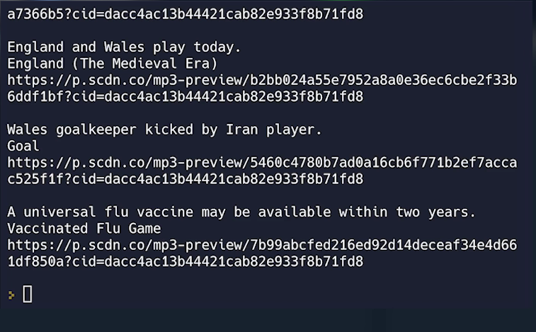

# 👉 Day 95 Challenge

Today's challenge is to create a daily track generator. 

Your program should:

1. Pull in 5 of the most recent news stories in your area. (You could also specify a category here to avoid all the depressing stuff out there.)
2. Ask openai to summarise each story in two to three words.
3. Pass those words to Spotify in a search. Show and give a sample of each song.
4. No need to build this in Flask today. A command line program is just fine. The console should display:
    1. The name of each track (five tracks)
    2. The prompt words used for the search
    3. The URL to get the sample

Example:

 
 💡 Hints 

  
- Don't forget your secrets.
- You can ask openai to summarize in pretty much plain text.  Try this `prompt = (f"""Summarize {article["url"]} in no more than four words.""")`

